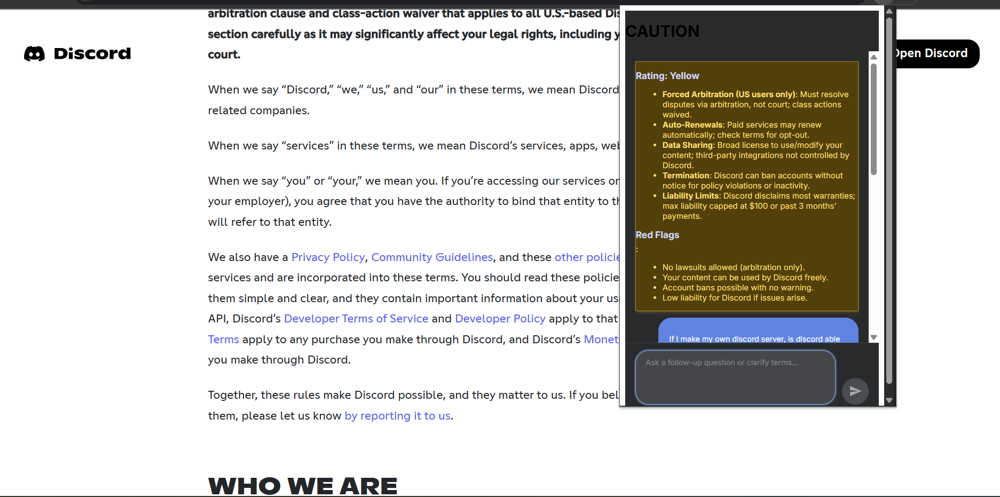

# ⚖️ Local Legal LLM Chrome Extension — "Fineprint"

> **We all know you hit agree to terms and conditions without reading any of it**  
> A privacy-first AI Chrome Extension that analyzes terms, contracts, and fine print **100% locally**, highlights red flags, and presents the legalese in a clean, color-coded UI — powered by a finetuned local LLM.

---

## 🧠 Core Functionallity

This is not just a chatbot. It's your **personal legal assistant**, built into Chrome.

- 📝 **Localizes and Finds Legal Texts**: Detects any TOS, contract, or clause on your window and proposes option to open extention.
- 🔎 **Simplifies**: Gives you a simple Multilingual or Plain English breakdown of important clauses without any confusing or misleading jargon.
- 🚨 **Detects Red Flags**: Flags alarming clauses (e.g. arbitration, data sharing) with **red alert highlights**.
- 🤗 **Intelligently Reasons through Follow-ups** User can ask specfic and reasoning based followup questions about policies or anything on the document.
- 🎨 **Color-Coded UI**: Uses custom trained ML model to detect between the following:
  - ✅ Green: Safe / Standard clauses
  - ⚠️ Yellow: Requires attention
  - ❌ Red: Potentially harmful/legal red flags
- 🔐 **100% Local, Private**: Option for HuggingFace Serverless, no data sent anywhere about your private queries. 

---

## 📸 Preview

  
_A screenshot of red/yellow/green clause classification and simplified summary in the popup._

---

## 🛠️ Tech Stack

- **TypeScript + React**
- **Chrome Extension API(VITE)**
- **Transformers.js by Xenova(Hugging Face)**
- **ONNX Runtime / WebAssembly**
- **Finetuned Legal Prompt Engineering**

---

## 🚀 Setup Instructions

```bash
git clone https://github.com/yourname/legal-llm-extension
cd legal-llm-extension
npm install
npm run build
